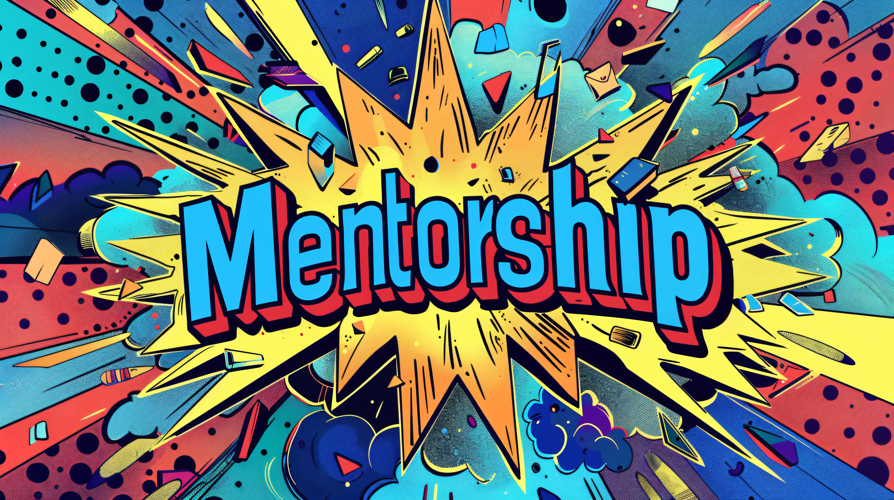

  

<h1 style="text-align: center;">Welcome to the Graduate Student Peer Mentorship Program!</h1>
This program is designed to help support incoming UC Berkeley Psychology first-year graduate students. First-year students are typically paired with more senior graduate students who can provide insight and guidance on a variety of topics.

## [People]
Learn more about the mentors in this year's program and what they can help you with!

## [Upcoming Events]

## Contact Us
If you have any questions, feel free to send us (the program coordinators) an [email](mailto:alyson_wong@berkeley.edu,kcassutt@berkeley.edu,jenpark23@berkeley.edu,s.hong@berkeley.edu,victoria_keating@berkeley.edu). 

