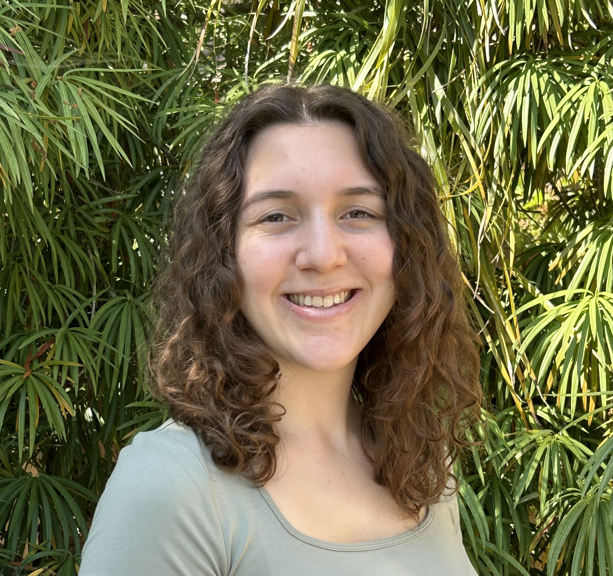
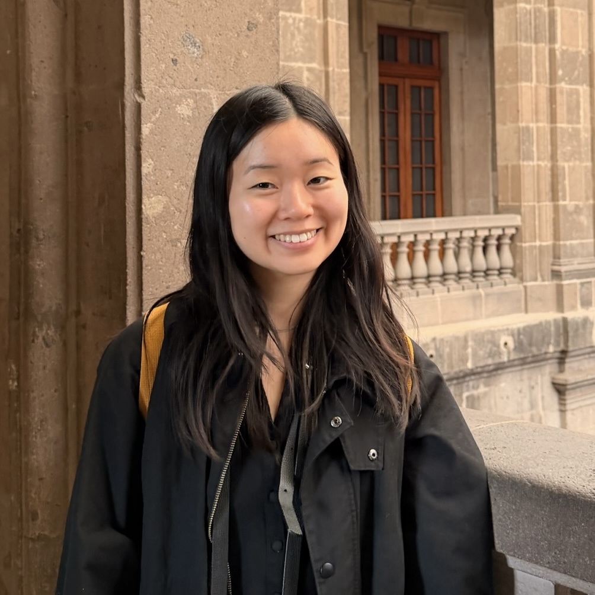
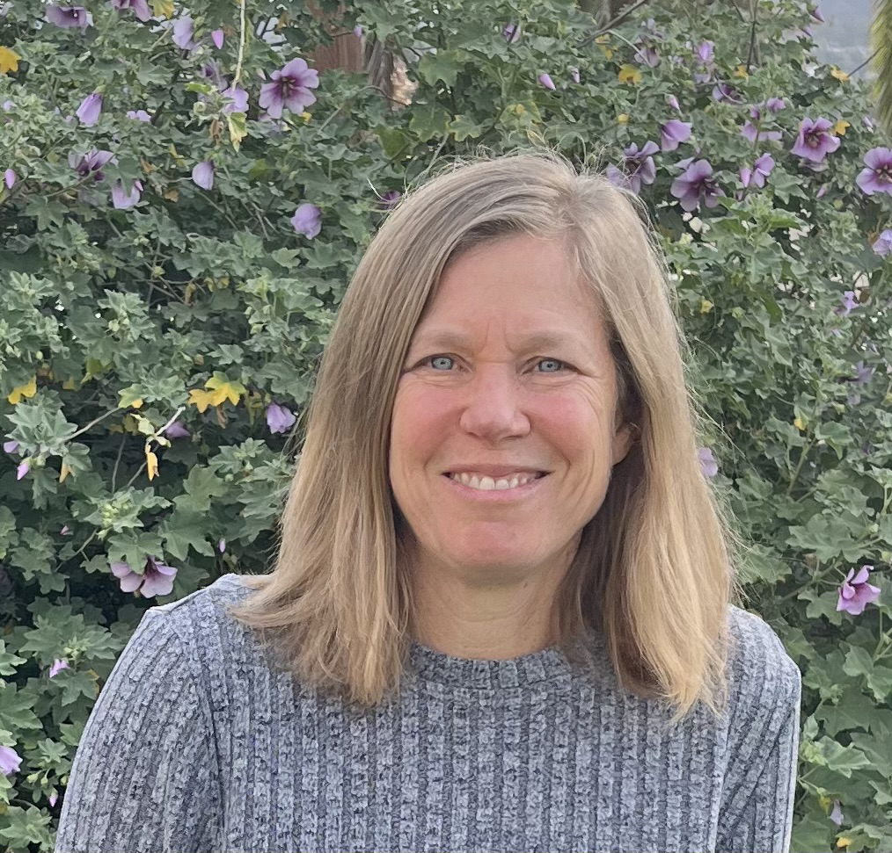
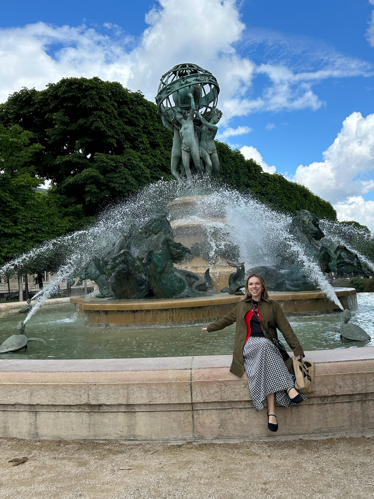
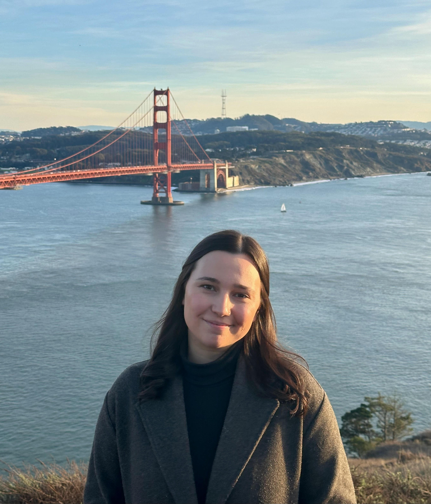
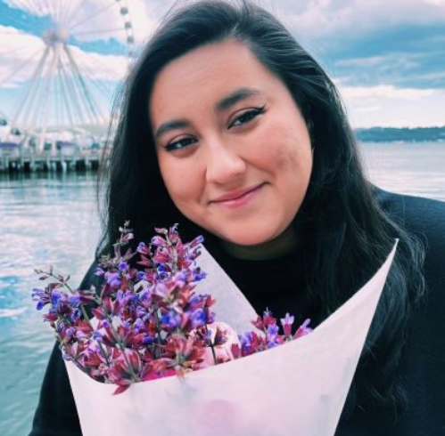

# People

<i>All mentors and coordinators with their email and topics listed are open to being contacted by any mentees! Feel free to reach out to anyone, including other mentors who you are not paired with.</i>

## Program Coordinators

  
  

    <h3>Alyson Wong</h3>
    <b>Email</b>: <a href="mailto:alyson_wong@berkeley.edu">alyson_wong@berkeley.edu</a> 
    <b>Area</b>: Developmental 
    <b>Open to Being Contacted About</b>: Statistics, Public Speaking, Coding, Advisor/Advisee Relationships, Funding Resources
  

  
  

    <h3>Kylie Cassutt</h3>
    <b>Email</b>: <a href="mailto:kcassutt@berkeley.edu">kcassutt@berkeley.edu</a> 
    <b>Area</b>: Social-Personality 
    <b>Open to Being Contacted About</b>: Statistics, Coding, Advisor/Advisee relationship, Work/Life Balance
  

  
  

    <h3>Jen Park</h3>
    <b>Email</b>: <a href="mailto:jenpark23@berkeley.edu">jenpark23@berkeley.edu</a> 
    <b>Area</b>: Cognition 
    <b>Open to Being Contacted About</b>: Navigating your first year
  

  
  

    <h3>Shannon Hong</h3>
    <b>Email</b>: <a href="mailto:s.hong@berkeley.edu">s.hong@berkeley.edu</a> 
    <b>Area</b>: Clinical 
    <b>Open to Being Contacted About</b>: Public Speaking, Science Communication, Advisor/Advisee Relationships, Work/Life Balance
  

## Graduate Student Mentors

  
  

    <h3>Gillian Ozawa</h3>
    <b>Email</b>: <a href="mailto:gillian_ozawa@berkeley.edu">gillian_ozawa@berkeley.edu</a> 
    <b>Area</b>: Cognitive Neuroscience 
    <b>Open to Being Contacted About</b>: Advisor/Advisee relationship, Funding Resources, Work/Life Balance, Networking
  

  
  

    <h3>Maggie Vashel</h3>
    <b>Email</b>: <a href="mailto:maggie_vashel@berkeley.edu">maggie_vashel@berkeley.edu</a> 
    <b>Area</b>: Cognitive Neuroscience 
    <b>Open to Being Contacted About</b>: Statistics, Coding, Advisor/Advisee relationship, Funding Resources, Work/Life Balance
  

  
  

    <h3>Maria Luciani</h3>
    <b>Email</b>: <a href="mailto:marialu@berkeley.edu">marialu@berkeley.edu</a> 
    <b>Area</b>: Social-Personality 
    <b>Open to Being Contacted About</b>: Statistics, Public Speaking, Science Communication, Advisor/Advisee Relationships, Work/Life Balance, Dyadic Designs & Multi-Level Analyses
  

  
  

    <h3>Sophia Oliver</h3>
    <b>Email</b>: <a href="mailto:smoliver@berkeley.edu">smoliver@berkeley.edu</a> 
    <b>Area</b>: Clinical 
    <b>Open to Being Contacted About</b>: Statistics, Coding, Funding Resources, Work/Life Balance
  

  
  

    <h3>Yaqi Ji</h3>
    <b>Email</b>: <a href="mailto:yaqi_ji@berkeley.edu">yaqi_ji@berkeley.edu</a> 
    <b>Area</b>: Cognitive Neuroscience 
    <b>Open to Being Contacted About</b>: Statistics, Science Communication, Advisor/Advisee Relationships, Work/Life Balance
  

  
  

    <h3>Yasmín Landa</h3>
    <b>Email</b>: <a href="mailto:yaslanda@berkeley.edu">yaslanda@berkeley.edu</a> 
    <b>Area</b>: Clinical 
    <b>Open to Being Contacted About</b>: Public Speaking, Advisor/Advisee Relationships, Funding Resources, Work/Life Balance, Networking, Navigating Grad School as a POC
  

  
  

    <h3>Ziwei Cheng</h3>
    <b>Email</b>: <a href="mailto:ziweicheng@berkeley.edu">ziweicheng@berkeley.edu</a> 
    <b>Area</b>: Cognition, Cognitive Neuroscience 
    <b>Open to Being Contacted About</b>: Statistics, Coding, Advisor/Advisee relationship, Work/Life Balance
  

