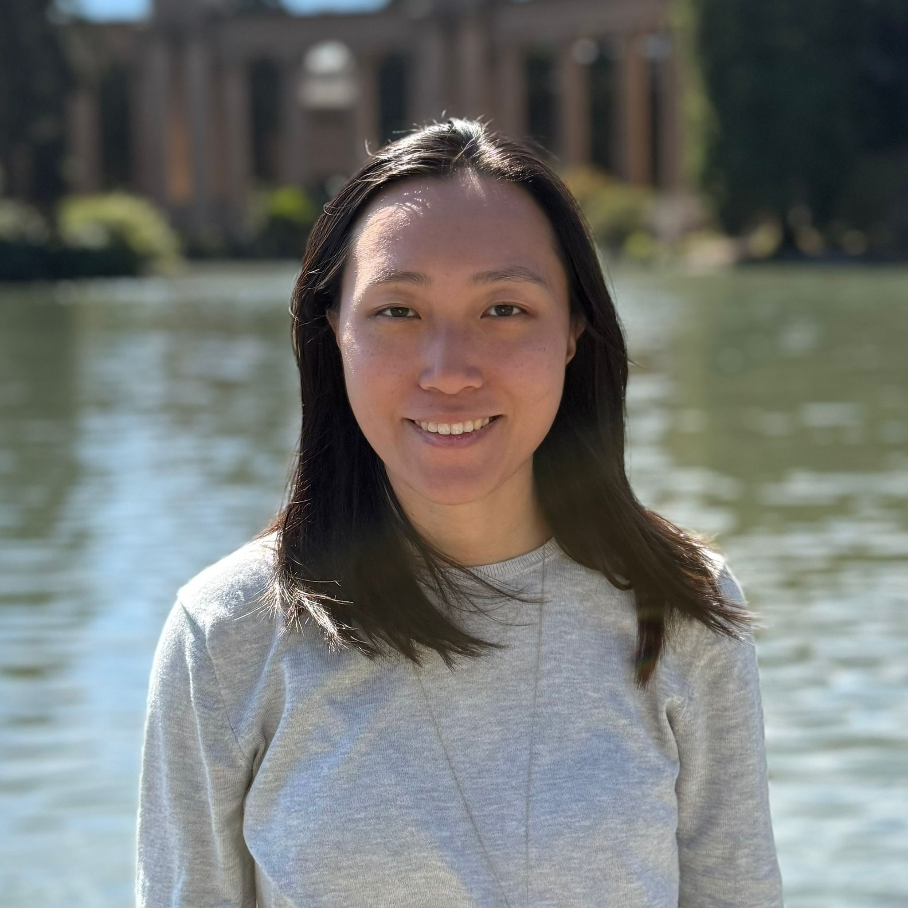

# People

<i>All mentors and coordinators with their email and topics listed are open to being contacted by any mentees! Feel free to reach out to anyone, including other mentors who you are not paired with.</i>

## Program Coordinators

  
  

    <h3>Alyson Wong</h3>
    <b>Email</b>: <a href="mailto:alyson_wong@berkeley.edu">alyson_wong@berkeley.edu</a> 
    <b>Area</b>: Developmental 
    <b>Open to Being Contacted About</b>: Statistics, Public Speaking, Coding, Advisor/Advisee Relationships, Funding Resources
  

  
  

    <h3>Jen Park</h3>
    <b>Email</b>: <a href="mailto:jenpark23@berkeley.edu">jenpark23@berkeley.edu</a> 
    <b>Area</b>: Cognition 
    <b>Open to Being Contacted About</b>: Navigating your first year
  

  
  

    <h3>Shannon Hong</h3>
    <b>Email</b>: <a href="mailto:s.hong@berkeley.edu">s.hong@berkeley.edu</a> 
    <b>Area</b>: Clinical 
    <b>Open to Being Contacted About</b>: Public Speaking, Science Communication, Advisor/Advisee Relationships, Work/Life Balance
  

## Graduate Student Mentors
